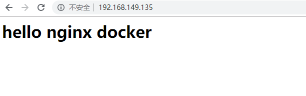

# Docker

## 1.安装docker

1.yum包的更新：

```shell
yum update
```

2.安装需要的软件包：yum-util提供yum-config-manager功能，另外两个是devicemapper驱动依赖的

```shell
yum install -y yum-util device-mapper-persistent-data lvm2
```

3.设置yum源

```shell
yum-config-manager --add-repo https://download.docker.com/linux/centos/docker-ce.repo
```

4.安装docker,出现输入的界面都输入y(加了-y自动选择了y)

```shell
yum install -y docker-ce
```

5.查看版本

```shell
docker -v
```

## 2.Docker的简单配置

把镜像加速器（docker hub）更改为阿里云的

```shell
进入阿里云服务器，打开菜单搜索镜像，选择CentOS,把代码复制直接使用
sudo mkdir -p /etc/docker
sudo tee /etc/docker/daemon.json <<-'EOF'
{
  "registry-mirrors": ["https://d8g01aps.mirror.aliyuncs.com"]
}
EOF
sudo systemctl daemon-reload
sudo systemctl restart docker
```

最终查询结果为下：


## 3.Docker命令

1.Docker 等等相关命令（可通过菜鸟教程查询Docker命令大全）

https://www.runoob.com/docker/docker-command-manual.html

```shell
启动docker服务：systemctl start docker
停止docker服务：systemctl stop docker
重启docker服务：systemctl restart docker
查看docker服务状态：systemctl status docker
开机启动docker服务：systemctl enable docker
```

2.镜像相关命令：

```shell
查看本地安装的镜像：docker images
查看所用镜像的id：docker images -q
安装（拉取）镜像命令：docker pull +镜像名称+ ：+版本
删掉镜像命令：docker rmi +ID 或者 docker rmi  +镜像名称+ ：+版本
搜索镜像:docker search 镜像名称
```


- 管理镜像常用命令：


- 管理容器常用命令


## 4.Docker容器的使用

(1).启动容器：

```shell
 docker run -it  --name=xxx centos /bin/bash
```

参数说明：

- **-i**: 交互式操作。
- **-t**: 终端。
- --name起名
- **ubuntu**: ubuntu 镜像。
- **/bin/bash**：放在镜像名后的是命令，这里我们希望有个交互式 Shell，因此用的是 /bin/bash。


(2).查看所有的容器命令如下：

```shell
$ docker ps -a
```

等等...

## 5.容器的数据卷

概念：


配置数据卷：


数据卷容器：


## 6.Docker应用部署

### 1.MySQL部署

1. 搜索mysql镜像

```shell
docker search mysql
```

2. 拉取mysql镜像

```shell
docker pull mysql:8.0
```

3. 创建容器，设置端口映射、目录映射

```shell
# 在/root目录下创建mysql目录用于存储mysql数据信息
mkdir ~/mysql
cd ~/mysql
```

```shell
docker run -id \
-p 3307:3306 \
--name=c_mysql \
-v $PWD/conf:/etc/mysql/conf.d \
-v $PWD/logs:/logs \
-v $PWD/data:/var/lib/mysql \
-e MYSQL_ROOT_PASSWORD=123456 \
mysql:5.6
```

- 参数说明：
  - **-p 3307:3306**：将容器的 3306 端口映射到宿主机的 3307 端口。
  - **-v $PWD/conf:/etc/mysql/conf.d**：将主机当前目录下的 conf/my.cnf 挂载到容器的 /etc/mysql/my.cnf。配置目录
  - **-v $PWD/logs:/logs**：将主机当前目录下的 logs 目录挂载到容器的 /logs。日志目录
  - **-v $PWD/data:/var/lib/mysql** ：将主机当前目录下的data目录挂载到容器的 /var/lib/mysql 。数据目录
  - **-e MYSQL_ROOT_PASSWORD=123456：**初始化 root 用户的密码。


4. 进入容器，操作mysql

```shell
docker exec –it c_mysql /bin/bash
```

5. 使用外部机器连接容器中的mysql


### 2.Tomcat部署

1. 搜索tomcat镜像

```shell
docker search tomcat
```

2. 拉取tomcat镜像

```shell
docker pull tomcat
```

3. 创建容器，设置端口映射、目录映射

```shell
# 在/root目录下创建tomcat目录用于存储tomcat数据信息
mkdir ~/tomcat
cd ~/tomcat
```

```shell
docker run -id --name=c_tomcat \
-p 8080:8080 \
-v $PWD:/usr/local/tomcat/webapps \
tomcat 
```

- 参数说明：

  - **-p 8080:8080：**将容器的8080端口映射到主机的8080端口

    **-v $PWD:/usr/local/tomcat/webapps：**将主机中当前目录挂载到容器的webapps


4. 使用外部机器访问tomcat


### 3.Nginx部署

1. 搜索nginx镜像

```shell
docker search nginx
```

2. 拉取nginx镜像

```shell
docker pull nginx
```

3. 创建容器，设置端口映射、目录映射


```shell
# 在/root目录下创建nginx目录用于存储nginx数据信息
mkdir ~/nginx
cd ~/nginx
mkdir conf
cd conf
# 在~/nginx/conf/下创建nginx.conf文件,粘贴下面内容
vim nginx.conf
```

```shell
user  nginx;
worker_processes  1;

error_log  /var/log/nginx/error.log warn;
pid        /var/run/nginx.pid;


events {
    worker_connections  1024;
}


http {
    include       /etc/nginx/mime.types;
    default_type  application/octet-stream;

    log_format  main  '$remote_addr - $remote_user [$time_local] "$request" '
                      '$status $body_bytes_sent "$http_referer" '
                      '"$http_user_agent" "$http_x_forwarded_for"';

    access_log  /var/log/nginx/access.log  main;

    sendfile        on;
    #tcp_nopush     on;

    keepalive_timeout  65;

    #gzip  on;

    include /etc/nginx/conf.d/*.conf;
}


```

要退到nginx目录


```shell
docker run -id --name=c_nginx \
-p 80:80 \
-v $PWD/conf/nginx.conf:/etc/nginx/nginx.conf \
-v $PWD/logs:/var/log/nginx \
-v $PWD/html:/usr/share/nginx/html \
nginx
```

- 参数说明：
  - **-p 80:80**：将容器的 80端口映射到宿主机的 80 端口。
  - **-v $PWD/conf/nginx.conf:/etc/nginx/nginx.conf**：将主机当前目录下的 /conf/nginx.conf 挂载到容器的 :/etc/nginx/nginx.conf。配置目录
  - **-v $PWD/logs:/var/log/nginx**：将主机当前目录下的 logs 目录挂载到容器的/var/log/nginx。日志目录

4. 使用外部机器访问nginx




### 4.Redis部署

1. 搜索redis镜像

```shell
docker search redis
```

2. 拉取redis镜像

```shell
docker pull redis:5.0
```

3. 创建容器，设置端口映射

```shell
docker run -id --name=c_redis -p 6379:6379 redis:5.0
```

4. 使用外部机器连接redis

```shell
./redis-cli.exe -h 192.168.149.135 -p 6379
```


## 7.Dockerfile


把容器转化为镜像==》创建一个新镜像

```
docker images
```


挂载tomcat上创建新镜像：

```
docker commit b8e65a4d736d +新镜像名称+:1.0
```

b8e65a4d736d这个是本机查询出来的id，根据自己的修改

然后把新的镜像打包

```
docker save -o +镜像名称.tar+ 镜像名称：1.0
```

如果删掉docker 中的镜像，可以拿压缩文件还原

```
docker load -i +镜像名称.tar
```


### 1.概念

- Dockerfile是一个文本文件
- 包含了一条条指令
- 每一条指令构建一层，基于基础镜像，最终构建出一个新的镜像
- 对于开发人员：可以为开发团队提供一个完全一致的开发环境
- 对于测试人员：可以直接拿开发时所构建的镜像或者提供Dockerfile文件构建一个新的镜像开始工作
- 对于运维人员：在部署时，可以实现应用的无缝移植


### 2.部署springboot项目：

然后编辑一个springboot_dockerfile文件

```shell
cd ./docker-files
vi springboot-dockerfile
```


接着运行文件生成镜像：

```
docker build -f ./文件名称 -t 镜像名称 .
```

然后用run生产一个容器

```
docker run -id -p 900:9000 +镜像名称
```


## 8.Docker服务编排


### 一.安装compose


#### 1.安装Docker Compose

```shell
# Compose目前已经完全支持Linux、Mac OS和Windows，在我们安装Compose之前，需要先安装Docker。下面我 们以编译好的二进制包方式安装在Linux系统中。 
curl -L https://github.com/docker/compose/releases/download/1.22.0/docker-compose-`uname -s`-`uname -m` -o /usr/local/bin/docker-compose
# 设置文件可执行权限 
chmod +x /usr/local/bin/docker-compose
# 查看版本信息 
docker-compose -version
```

#### 2.卸载Docker Compose

```shell
# 二进制包方式安装的，删除二进制文件即可
rm /usr/local/bin/docker-compose
```

#### 3.compose核心概念

- 一文件：docker-compose.yml
- 两要素：
  1. 服务（service）：一个个应用容器实例，比如订单微服务、库存微服务、mysql容器、nginx容器或者redis容器
  2. 工程（project）：由一组关联的应用容器组成发一个完整业务单元，在docker-compose.yml文件中定义。


#### 4.compose使用的三个步骤

- 编写Dockerfile定义各个微服务应用并构建出对应的镜像文件
- 使用docker-compose.yml定义一个完整的业务单元，安排好整体应用中的各个容器服务。
- 最后，执行docker-compose up命令来启动并运行整个应用程序，完成一键部署上线


#### 5.compose常用命令


####  6.使用docker compose编排nginx+springboot项目

1. 创建docker-compose目录

```shell
mkdir ~/docker-compose
cd ~/docker-compose
```

2. 编写 docker-compose.yml 文件

```shell
version: '3'
services:
  nginx:
   image: nginx
   ports:
    - 80:80
   links:
    - app
   volumes:
    - ./nginx/conf.d:/etc/nginx/conf.d
  app:
    image: app
    expose:
      - "8080"
```

3. 创建./nginx/conf.d目录

```shell
mkdir -p ./nginx/conf.d
```


4. 在./nginx/conf.d目录下 编写itheima.conf文件

```shell
server {
    listen 80;
    access_log off;

    location / {
        proxy_pass http://app:8080;
    }
   
}
```

5. 在~/docker-compose 目录下 使用docker-compose 启动容器

```shell
docker-compose up
```

6. 测试访问

```shell
http://192.168.149.135/hello
```

## 9.Docker 私有仓库

### 一、私有仓库搭建

```shell
# 1、拉取私有仓库镜像 
docker pull registry
# 2、启动私有仓库容器 
docker run -id --name=registry -p 5000:5000 registry
# 3、打开浏览器 输入地址http://私有仓库服务器ip:5000/v2/_catalog，看到{"repositories":[]} 表示私有仓库 搭建成功
# 4、修改daemon.json   
vim /etc/docker/daemon.json    
# 在上述文件中添加一个key，保存退出。此步用于让 docker 信任私有仓库地址；注意将私有仓库服务器ip修改为自己私有仓库服务器真实ip 
{"insecure-registries":["私有仓库服务器ip:5000"]} 
# 5、重启docker 服务 
systemctl restart docker
docker start registry

```

### 二、将镜像上传至私有仓库

```shell
# 1、标记镜像为私有仓库的镜像     
docker tag centos:7 私有仓库服务器IP:5000/centos:7
 
# 2、上传标记的镜像     
docker push 私有仓库服务器IP:5000/centos:7

```


### 三、 从私有仓库拉取镜像 

```shell
#拉取镜像 
docker pull 私有仓库服务器ip:5000/centos:7
```

