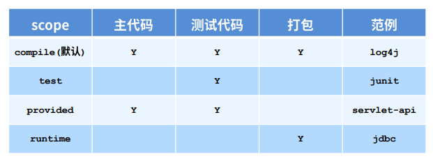
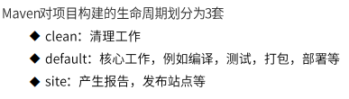
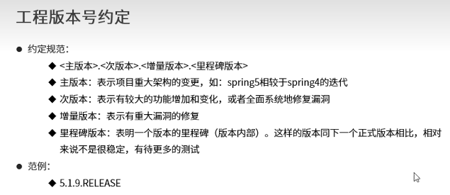

# Maven基础

## 一.Maven的理解：

Maven 是 Apache 软件基金会的一个开源项目,是一个优秀的项目构建工具,它用来帮助开发者管理项目中的 jar,以及 jar 之间的依赖关系、完成项目的编译、测试、打包和发布等工作。

### 1.Maven是什么？

- mvaen的本质是一个项目管理工具，将项目开发和管理过程抽象成一个项目对象模型(POM)
- POM(Project Object Model):项目对象模型


### 2.Maven的作用是什么？

- 项目构建：提供标准的、跨平台的自动化项目构建方式

- 依赖管理：方便快捷的管理项目依赖的资源（jar包），避免资源间的版本冲突问题

- 统一开发结构：提供一个标准的、统一的项目结构

  

  

## 二.Maven的下载和安装

### 1.官网

先进入官网http://maven.apache.org/进行下载或者用文件中带有的压缩包，解压就可应用

### 2.环境的配置

- 先配置好JAVA环境，JAVA_HOME

  | 变量名    | 变量值                                      |
  | --------- | ------------------------------------------- |
  | JAVA_HOEM | JDK安装的路径                               |
  | CLASSPATH | .;%JAVA_HOME%\lib;%JAVA_HOME%\lib\tools.jar |

  点击系统环境中path配置环境变量，新添%JAVA_HOME%\bin和%JAVA_HOME%\jre\bin

  

- 在系统环境中配置环境变量

  | 变量名     | 变量值        |
  | ---------- | ------------- |
  | MAVEN_HOME | maven安装路径 |

  在path中配置到bin目录：%MAVEN_HOME%\bin

- 在命令行中输入mvn -version可查看安装版本


### 3.配置maven本地仓库

先打开本地下载maven文件中的conf/setting.xml文件，修改本地仓库的存储目录（默认是存储在C盘中的.m2文件中）


 为了提高下载速度，可在如图所示位置配置阿里云仓库


## 三.Maven的基础概念

### 1.仓库：


仓库的分类：

- 本地仓库：自己电脑上的资源存储仓库，连接远程仓库获取资源
- 远程仓库：非本地电脑上的仓库，为本地仓库提供资源
  - 中央仓库：Maven团队维护，中央仓库中的jar都是开源的，不能存储具有版权的资源
  - 私服：部门/公司范围内存储资源的仓库，从中央仓库获取资源
- 私服的作用：
  - 保存具有版权等等资源，包括购买或者自主开发的jar
  - 一定范围内共享资源，仅对内部开放，不对外共享


### 2.坐标：

- 什么是坐标？

  maven中的坐标用于描述仓库中资源的位置

  https://repo1.maven.org/maven2/

- Maven坐标的主要组成

  - groupId：定义当前Maven项目隶属组织名称
  - artfactId：定义当前Maven项目名称
  - version：定义当前项目的版本号

- 坐标的作用

  使用唯一标识，唯一性定位资源位置，通过该标识可以将资源的识别与下载交由机器完成

## 四.Maven项目

- 在src同层目录下创建pom.xml

  

- 构建命令：（在cmd中运行）

  

手工创建工程：


插件：


## 五.依赖管理

### 1.依赖传递

- 依赖具有传递性：
  - 直接依赖：在当前项目中通过依赖配置建立的依赖关系
  - 间接依赖：

### 2.依赖传递冲突问题


### 3.可选依赖

- 指对外隐藏当前所依赖的资源----不透明

### 4.排除依赖

- 指主动断开依赖的资源，被排除的资源无需指定版本


### 5.依赖的范围

- 依赖的jar默认情况可以在任何地方使用，可以通过scope标签设定其作用范围
- 作用范围：
  - 主程序范围有效（main文件夹范围内）
  - 测试程序范围有效（test文件夹范围内）
  - 是否参与打包（package指令范围内）



### 6.依赖范围传递性

- 带有依赖范围的资源在进行传递时，作用范围将受到影响

  

## 六.生命周期与插件

maven项目完整过程：先编译、对测试代码进行编译、测试、打包、安装

生命周期分为以下三个部分：



### 1.clean生命周期：


### 2.default构建生命周期：


如果我执行compile，会执行compile之前的所有（从上到下）


### 3.site构建生命周期：


### 4.插件：


------


# Maven高级

## 一.分模块开发和设计

工程模块与模块划分==》将一个模块分为多个模块（用于多功能开发）


 当我们编译某个模块时，我们要保证仓库中所依赖的资源都要有


```
分模块开发：
1.模块中仅包含当前模块对应的功能类与配置文件
2.spring核心配置根据模块功能不同进行单独制作
3.当前模块所依赖的模块通过导入坐标的形式加入当前模块后才可以使用
4.web.xml需要加载所有的spring核心配置文件
```

## 二.聚合

### 1.多模块构建维护：

 当拆分项目后，运行一个模块可能其他的模块没有运行，所以这时候需要创建一个新的模块去管理其他模块，运行新的模块，其他的模块也可以一起运行，这个工程叫聚合。


作用：集合用于快速构建maven工程，一次性构建多个项目/模块。

### 2.制作方法：

- 创建一个空模块，打包类型定义为pom

  ```java
  <packaging>pom</packaging>
  ```

- 定于当前模块进行构建操作时关联的其他模块名称

  

- 注意事项：参与聚合操作时的模块最终执行顺序与模块间的依赖关系有关，与配置顺序无关

## 三.继承

- 作用：通过继承可以实现在子工程中沿用父工程中的配置

  - maven中的继承与Java中的继承相似，在子工程中配置继承关系

- 制作方式：

  - 在子工程中声明其父工程坐标与对应的位置

    

### 1.继承依赖定义

在父工程中定义依赖管理


### 2.继承依赖使用

在子工程中定义依赖关系，无需声明依赖版本，版本参照父工程中依赖的版本


### 3.继承的资源


### 4.继承与聚合

```
作用：
1.聚合用于快速构建项目
2.继承用于快速配置
相同点：
1.聚合与继承的pom.xml文件打包方式均为pom，可以将两种关系制作到同一个pom文件中
2.聚合与基础均属于设计型模块，并无实际的模块内容
不同点：
1.聚合是在当前模块中配置关系，聚合库感知到参与聚合的模块有哪些
2.继承是在子模块中配置关系，父模块无法感知哪些子模块继承了自己
```

## 四.属性

属性类型：

1. 自定义属性
2. 内置属性
3. Setting属性
4. Java系统属性
5. 环境变量属性

### 1.自定义属性（常用）

作用：等同于定义变量，方便统一维护

定义格式：

```
<properties>
	自定义名称
	<xxx.version>版本</xxx.version>
</properties>
```

### 2.内置属性

作用：使用maven内置属性，快速配置

调用格式：

```
${version}
${basedir}
```

### 3.Setting属性

作用：使用Maven配置文件setting.xml中的标签属性，用于动态配置

调用格式：

```
${settings.;localRepository}
```

### 4.Java系统属性

作用：读取Java系统属性

调用格式：

```
${user.home}
```

系统属性查询方式：

```cmd
mvn help:system
```

### 5.环境变量配置

作用：使用Maven配置文件setting.xml中的标签属性，用于动态配置

调用格式：

```
${env.JAVA_HOME}
```

环境变量属性查询方式：

```cmd
mvn help:system
```

## 五.版本管理

```
SNAPAHOT(未完成版==>快照版本)：
	1.项目开发工程中，为方便团队成员合作，解决模块间相互依赖和时时更新的问题，开发者对每一个模块进行构建的时候，输出的临时性的版本（测试阶段版本）；
	2.随着开发的进展不断更新。

RELEASE(完成版==>发布版本)：
	1.项目开发进入阶段里程碑后，向团队外部发布较为稳定的版本，这种版本对应的构件文件是稳定的，即便进行功能的后续开发，也不会更改当前发布的版本内容。
```



## 六.多环境开发配置


## 七.私服

分模块合作开发：常用的私服（Nexus）

### 1.私服资源的获取

仓库分类：

- 宿主仓库hosted
  - 保存无法从中央仓库获取的资源
    - 自主研发
    - 第三方非开源项目
- 代理仓库proxy
  - 代理远程仓库，通过nexus访问其他公共仓库，例如中央仓库
- 仓库组group
  - 将若干个仓库组成有关群组，简化配置
  - 仓库组不能保存资源，属于设计型仓库